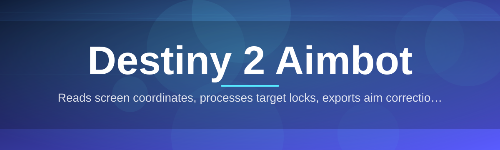
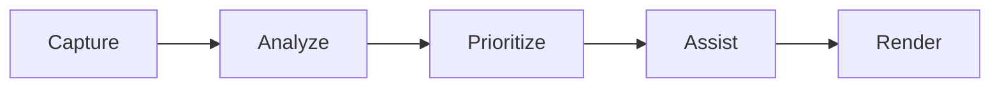

# destiny-2-aim-assistant 🎯🚀

  

*Precision when you need it, invisible when you don't.*

  

## 🌌 What This Is NOT

Let's clear the air before anything else.

**This is not** a clunky, decade-old memory-editing relic that gets your account flagged in an hour. **This is not** a "one-click win every gunfight" fantasy tool. **This is not** bloatware stuffed with adware, miners, or telemetry you didn't ask for.

**What it actually is:** a lightweight, standalone Destiny 2 aim assistant built for players who want smoother tracking, faster reaction windows, and fewer whiffed shots in a game where 0.2 seconds decides a Trials match. It reads the screen, computes target vectors, and nudges your aim toward where the fight is actually happening — the rest is still on you.

> [!NOTE]
> `destiny-2-aim-assistant` is built by players who got tired of losing 1v1s to input lag and controller drift, not by people trying to ruin your Crucible experience.

## 🛰️ Overview

Destiny 2's combat sandbox is fast, vertical, and unforgiving. Between Guardian movement abilities, ability-spam metas, and weapons with tight optimal ranges, tracking a moving target across three axes is genuinely hard — even for players with years of FPS experience. `destiny-2-aim-assistant` exists to close that gap between intent and execution, giving your reticle a subtle assist so your mechanical skill actually translates into hits.

This isn't about turning you into an unbeatable Guardian overnight. It's about consistency — the same clean tracking on your 40th Crucible match of the night as your 1st, when fatigue and reflexes start working against you. Raid encounters with erratic add spawns, Trials duels against sweaty six-stacks, Gambit invaders who peek for half a second — these are the moments this tool is tuned for.

It's built for solo players grinding Trials flawless runs, casual Guardians who just want fights to feel less frustrating, and anyone whose hardware (mouse, monitor refresh rate, or just plain human reflexes) puts them at a mechanical disadvantage. **No dependencies, no background services, no nonsense** — just a focused utility that respects your system and your time.

---

## ⚡ What Makes It Tick

**Adaptive Target Tracking** — Instead of snapping to the nearest hitbox like a blunt instrument, it weighs distance, movement velocity, and screen-center proximity to pick the target that actually makes sense in the fight.

**Weapon-Aware Sensitivity Curves** — Scout Rifles, Hand Cannons, and Fusion Rifles behave differently at range. The assist scales its pull based on the weapon archetype you're holding, so a sniper flick doesn't feel like a shotgun jerk.

**Silent Overlay Rendering** — All visual feedback (FOV circle, target lock indicator) renders through a lightweight overlay layer with near-zero frame cost, so your FPS counter stays exactly where it should be.

**Per-Activity Profiles** — Save distinct configurations for Crucible, Gambit, and PvE content. Switch modes with a hotkey instead of digging through menus mid-match.

**Humanized Movement Curves** — Linear snapping looks robotic and feels worse to play with. Movement is smoothed with configurable easing so tracking feels like an extension of your hand, not a magnet.

**Low-Footprint Engine** — Built to sip resources, not gulp them. Runs comfortably alongside Destiny 2 and your voice chat client without touching your frame budget.

**Hotkey-Driven Control** — Toggle everything on the fly. No alt-tabbing, no pausing your game, no breaking flow mid-encounter.

**Configurable FOV Window** — Define exactly how much of your screen counts as the "engagement zone" so the assist only reacts inside a radius you choose.

> [!TIP]
> Start with a small FOV radius and a slow smoothing curve. Most new users crank both up too fast and end up fighting the assist instead of flowing with it.

---

## 🧭 Getting Started

Four steps and you're in the fight.

1. **Visit the landing page** using the download button above or below.

2. **Download the latest build** — it's packaged as a standalone executable, nothing else required.

3. **Run it before launching Destiny 2** (or after — order doesn't matter, just make sure both are running).

4. **Open the in-app overlay** with the default hotkey, tune your settings, and drop into your activity.

> [!IMPORTANT]
> Always download from the official landing page linked in this README. Anything claiming to be `destiny-2-aim-assistant` from a random forum link is not us.

---

## 🖥️ System Requirements

| Component | Minimum | Recommended |
|---|---|---|
| **OS** | Windows 10 (64-bit) | Windows 11 (64-bit) |
| **RAM** | 8 GB | 16 GB |
| **Disk** | 250 MB free | 500 MB free |
| **GPU** | DirectX 11 compatible | Dedicated GPU, DirectX 12 |
| **Other** | Administrator rights for first launch | Stable internet for updates |

  

No frameworks to install. No runtime packages to chase down. It just runs.

---

## 🧩 How It Works

The pipeline is intentionally simple — fewer moving parts means fewer things that can break mid-raid.

1. **Capture** — A frame grabber reads the active game window at high frequency without hooking into the game process itself.

2. **Analyze** — Computer-vision passes scan the frame for visual target signatures (enemy silhouettes, highlighted hitmarkers).

3. **Prioritize** — Detected targets get scored by distance, angle from center, and movement pattern.

4. **Assist** — A smoothed input curve nudges your aim vector toward the highest-priority target within your configured FOV.

5. **Render** — The overlay draws lightweight feedback (lock indicator, FOV ring) so you always know what the assist is doing.

> [!WARNING]
> This tool interacts with input and display layers only — it never reads or modifies game memory. That's a deliberate design choice, not a limitation.

---

## 🛠️ Troubleshooting

<strong>The overlay isn't showing up in-game</strong>

Make sure Destiny 2 is running in Borderless Fullscreen, not Exclusive Fullscreen. Exclusive mode blocks overlay rendering on most Windows setups.

<strong>Aim assist feels jittery or overcorrects</strong>

Lower the smoothing intensity in Settings → Tracking. Most jitter comes from a smoothing curve set too aggressive for your mouse DPI.

<strong>Hotkeys aren't responding</strong>

Another overlay app (Discord, GeForce Experience) may be intercepting the same keybind. Change the hotkey in Settings → Controls to something unused.

<strong>FPS dropped after launching the assistant</strong>

Check that hardware-accelerated rendering is enabled in Settings → Performance. Software rendering fallback is slower but kicks in automatically on unsupported GPUs.

<strong>It stopped working after a Destiny 2 update</strong>

Bungie's client updates occasionally shift internal rendering behavior. Check the landing page for a compatibility patch — these usually ship within 24-48 hours of a game update.

<strong>Windows Defender flagged the download</strong>

This is common for unsigned indie tools that read screen input. Verify you downloaded from the official landing page link, then allow the file through your antivirus manually.

---

## 🎨 UI & UX Details

| Shortcut | Action |
|---|---|
| `F1` | Toggle assist on/off |
| `F2` | Cycle activity profile (PvP / PvE / Gambit) |
| `F3` | Open quick settings overlay |
| `F4` | Toggle FOV ring visibility |
| `Insert` | Panic-hide overlay instantly |

**Themes** — Choose between Dark Slate, Guardian Gold, and a minimal High-Contrast mode built for streaming setups.

**Settings persistence** — All profiles autosave locally; nothing is uploaded, nothing syncs to an account.

**Low-latency overlay** — Rendered on a separate thread from input processing, so tweaking a slider never causes tracking hiccups.

---

## 🤝 Contributing & Community

Bug reports, feature ideas, and pull requests are genuinely welcome — this project grows because Guardians keep pushing it forward.

* **Found a bug?** Open an issue with your build version, GPU, and a short repro description.

* **Have an idea?** Start a discussion thread before opening a big PR — saves everyone time.

* **Want to contribute code?** Fork, branch, and submit a PR against `main`. Keep changes focused and documented.

> [!TIP]
> New contributors: check issues tagged `good-first-issue` — they're scoped small on purpose.

---

## 📜 License

Released under the [MIT License](LICENSE), 2026.

Use it, study it, modify it — just keep the license notice intact.

---

## ⚖️ Disclaimer

`destiny-2-aim-assistant` is an independent fan-made project and is not affiliated with, endorsed by, or connected to Bungie, Inc. Destiny 2 is a trademark of Bungie, Inc. Use of any third-party tool with online games carries inherent account risk — use at your own discretion and always review the current terms of service for the game you're playing. This project is provided as-is, without warranty of any kind.

